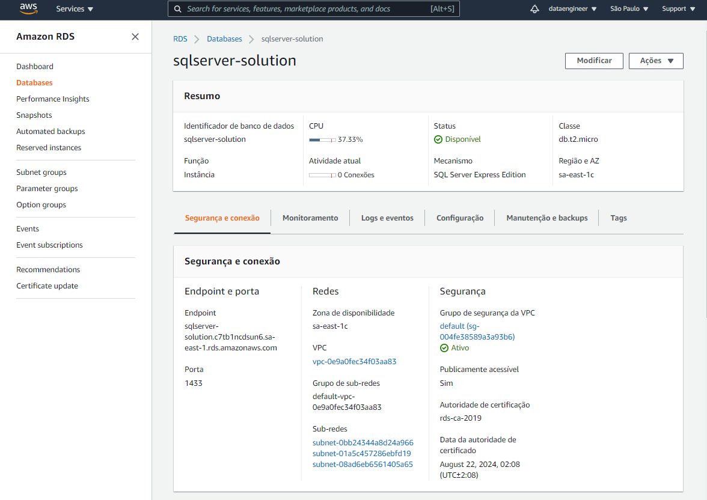
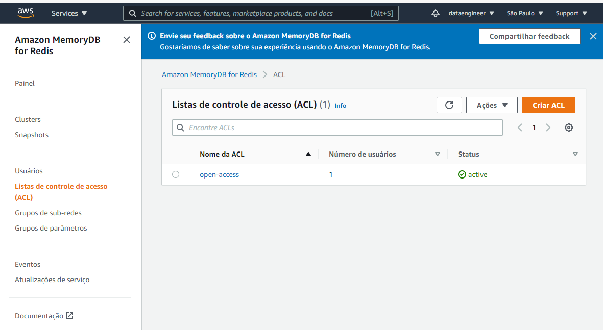
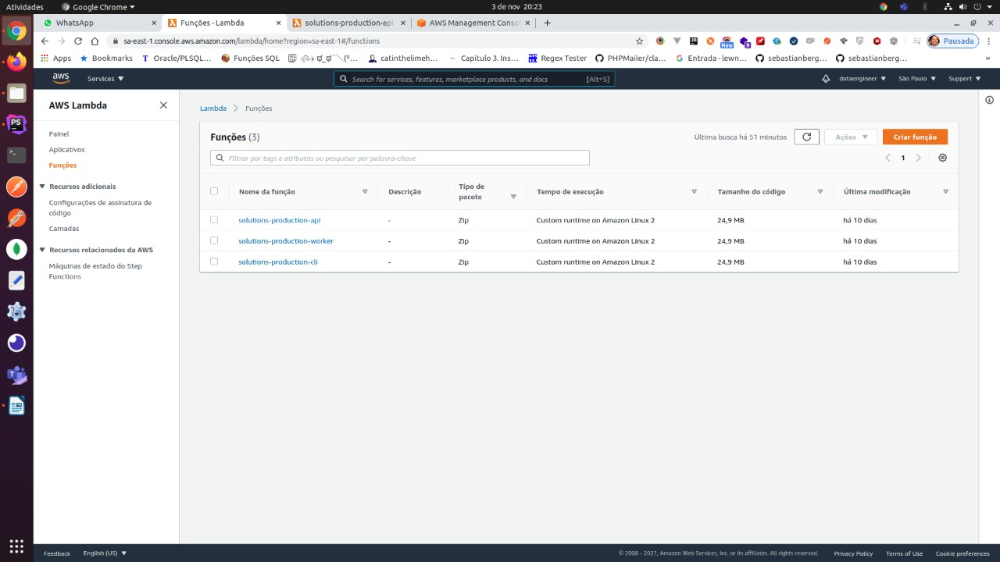
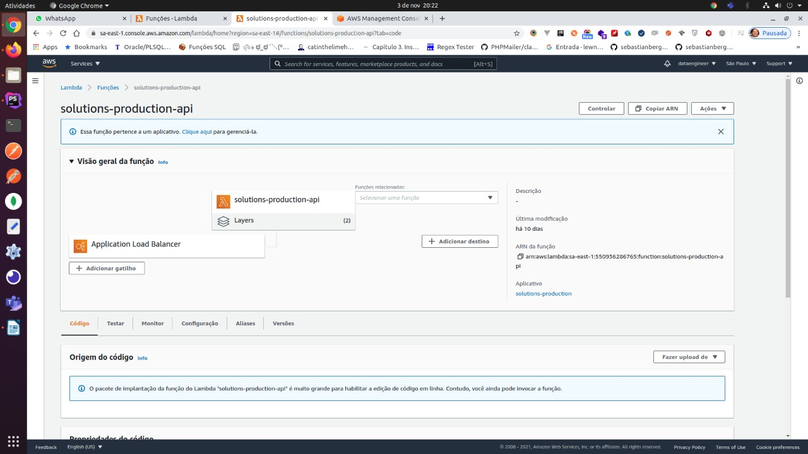
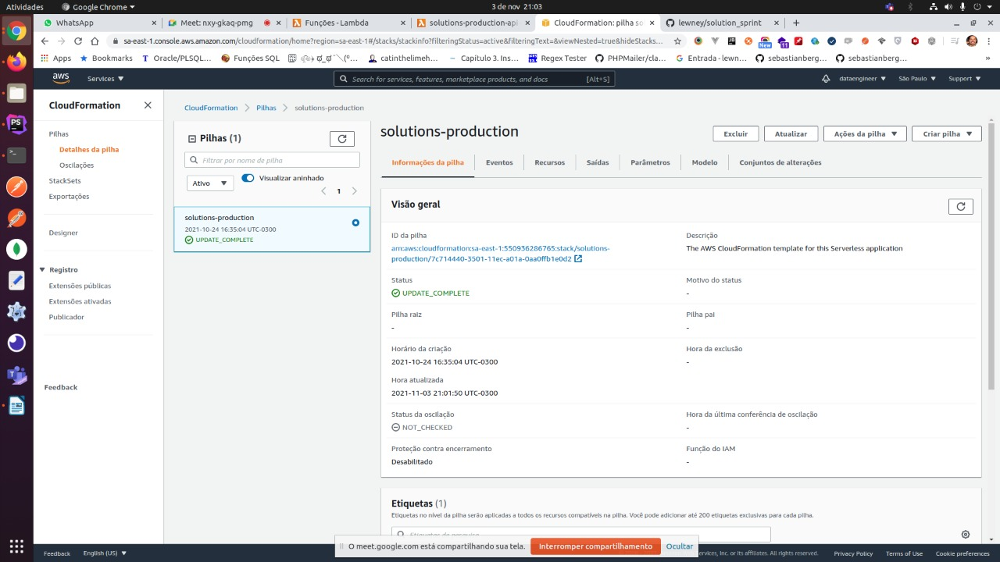

# [Banco de Dados SQL Server na AWS](https://sa-east-1.console.aws.amazon.com/rds/home?region=sa-east-1#database:id=sqlserver-solution;is-cluster=false)

</img>

# [Banco de Dados Redis na AWS](https://sa-east-1.console.aws.amazon.com/memorydb/home?region=sa-east-1#/acls)

</img>

# [AWS Lambda](https://sa-east-1.console.aws.amazon.com/lambda/home?region=sa-east-1#/functions)

</img>

# [Redis in Load Balancer](https://sa-east-1.console.aws.amazon.com/lambda/home?region=sa-east-1#/functions/solutions-production-api?tab=code)

</img>

# [Cloud Formation](https://sa-east-1.console.aws.amazon.com/cloudformation/home?region=sa-east-1#/stacks?filteringStatus=active&filteringText=&viewNested=true&hideStacks=false)

</img>

