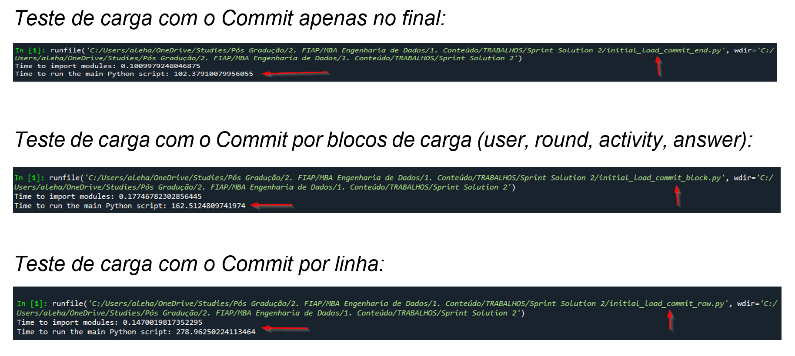

# Scripts para ingestão dos dados em Python

## Criando a infraestrutura no SQL Server - Database, usuário da aplicação e tabelas

Após criado o banco de dados na AWS, executar os scripts abaixo, com o usuário admin:

- Script para criação do database [1_sqlserver_create_database.sql](https://github.com/san-data-engineer/solutionSprint2/tree/master/Scripts/1_sqlserver_create_database.sql)
- Script para criação do usuário da aplicação e de tabelas para carga inicial [2_sqlserver_create_structure.sql](https://github.com/san-data-engineer/solutionSprint2/tree/master/Scripts/2_sqlserver_create_structure.sql)

## Realizando e validando as cargas iniciais

  Foi realizado testes de carga, explorando os momentos de commit, fazendo-o por linha, por bloco e ao final de toda carga. Estes scripts podem também ser encontrados abaixo ou na pasta Scripts/

  - Script para carga inicial por linha [initial_load_commit_row.py](https://github.com/san-data-engineer/solutionSprint2/tree/master/Scripts/initial_load_commit_row.py)
  - Script para carga inicial por bloco [initial_load_commit_block.py](https://github.com/san-data-engineer/solutionSprint2/tree/master/Scripts/initial_load_commit_block.py)
  - Script para carga inicial por linha [initial_load_commit_end.py](https://github.com/san-data-engineer/solutionSprint2/tree/master/Scripts/initial_load_commit_end.py)
  - Script para validação das cargas [3_validations.sql](https://github.com/san-data-engineer/solutionSprint2/tree/master/Scripts/3_validations.sql)

## Tempos de Execução das cargas iniciais

</img>
